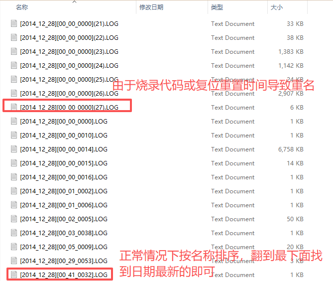

# TF_Log - STM32 TF卡数据记录系统

> 基于TF卡的串口日志系统，支持实时日志记录、多种配置管理和主控端Log模块代码

---


## 🔧 简介

### 核心硬件
- **MCU**: STM32F103
- **存储**: TF卡 (推荐使用某迪、某士顿，部分TF卡不支持SPI)
- **通信**: UART1 (主机端日志数据接收)、UART2（USB转串口CMD配置、使用USB串口助手读取实时主机端日志）、SPI1读写TF卡

**数据流向：**


**日志内容示例：**


**日志文件示例：**


---

## ✨ 核心特性

### 高性能数据采集
- ✅ **DMA单字节接收**: 默认115200波特率DMA串口收发
- ✅ **硬件加速帧扫描**: 使用`memchr`指令扫描帧尾，降低CPU占用
- ✅ **环形缓冲区**: 512-8192字节可配置，支持溢出策略配置

### 灵活的日志系统
- ✅ **多种时间戳格式**: 完整日期时间、月日时间、日时间、仅时间
- ✅ **自动文件命名**: `[文件序号][年_月_日][时_分_秒].log`
- ✅ **快速查找最新日志**: `[文件序号]`掉电不丢失，创建一个文件自增1，方便快速寻找最新日志文件
- ✅ **自动填充时间戳**: `[月_日][时_分_秒]......`
- ✅ **自动保存**: 定时同步文件到tf卡，避免丢日志
- ✅ **双路输出**: 同时输出到RTT和文件

### 持久化配置管理
- ✅ **BKP寄存器存储**: 掉电不丢失配置
- ✅ **串口命令配置**: 运行可配置参数
- ✅ **RTC时间保持**: 重启后时间自动恢复

### 配套的主机端日志库 (RP_Log)
- ✅ **多种日志等级**: FATAL/ERROR/WARN/INFO/DEBUG/TRACE
- ✅ **自动文件行号**: 宏自动添加源文件名和行号
- ✅ **彩色终端输出**: RTT支持ANSI颜色
- ✅ **低侵入式日志**: 通过线程、环形缓冲区实现低侵入式日志系统

### TF卡热插拔恢复 
- ✅ **自动重挂载**: 定时检测TF卡离线状态，重新插入后自动挂载并创建新日志文件
- ✅ **自动保存**: 定时保存文件，防止热插拔丢失数据
- ✅ **状态跟踪**: 完整的状态机管理和统计信息

---

## 🚀 快速开始

1. 烧录程序`TF_Log.elf`到日志系统模块
2. 插入TF卡，使用SWD3.3V或串口5V给模块供电
3. 拔下TF卡，使用读卡器连接电脑，查看是否成功创建文件并写入文件头
4. 使用串口（波特率115200、无校验、8位数据位、1位停止位）给模块发送任意内容，重复步骤3查看是否成功写入日志
5. 移植RP_LOG日志库，体验自动填充`[日志等级][文件:行号]:`等功能

##  ⚙️串口命令配置

通过TypeC线连接模块使用串口发送以下命令（以`\r\n`结尾）：

```bash

# 设置时间格式
CMD:LOG_TIME_FORMAT_FULL          # 完整：2026_01_23 15:30:45
CMD:LOG_TIME_FORMAT_MONTH_DAY     # 月日：01_23 15:30:45
CMD:LOG_TIME_FORMAT_DAY           # 仅日：23 15:30:45
CMD:LOG_TIME_FORMAT_TIME_ONLY     # 仅时：15:30:45

# 设置缓冲区大小
CMD:RINGBUF_SIZE=8192

# 设置RTC时间（格式：YYYYMMDD,HHMMSS）
CMD:SET_TIME=20141228,010200

# 缓冲区溢出策略 
CMD:RINGBUF_POLICY_DISCARD_OLDEST    # 丢弃旧数据
CMD:RINGBUF_POLICY_DISCARD_NEWEST    # 丢弃新数据

# 设置日志文件保存间隔，若保存频率太高会导致写入tf卡阻塞，若太低可能会导致未及时保存导致断电时日志丢失（1~65535ms，默认500ms）
CMD:SYNC_INTERVAL=500

# 恢复出厂默认配置
CMD：RESET         


```

## :+1: 使用RP_Log主机端日志

```c

// 使用日志
RP_LOG_ERROR("Motor Offline:%s", motor_name);
RP_LOG_WARN("Battery low: %d%%", battery_level);

```

---

## ❓ 常见问题
1. 按照快速开始操作后，TF卡没有新建文件怎么办？
    - 请检查此TF是否支持SPI读写

2. 发送CMD命令后，配置似乎没改变怎么办？
    - 请检查CMD命令末尾是否带有新行`\r\n`，若没有则**需要加上**

3. 出现丢帧怎么办？
    - 请尝试适当增大缓冲区或降低发送频率。

4. 模块在发送ACMD41命令时一直返回0x01报错怎么办？
    - 请检查TF卡是否有3.3V供电

5. 打开日志文件发现没有日志怎么办？
    - 请使用并配置串口助手为波特率115200、无校验、8位数据位、1位停止位，检查是否能够正确收到主机端日志。
---
## 📄 许可证

MIT License

---

## 👤 作者

**SZU RobotPilots LYQ**

- 📧 Email: 741427745@qq.com

---

## 🙏 致谢

感谢所有为本项目提供建议和支持的朋友们！
